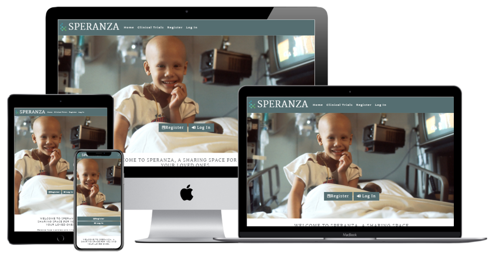
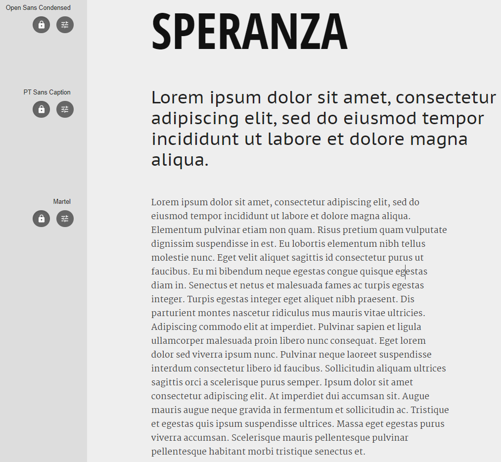
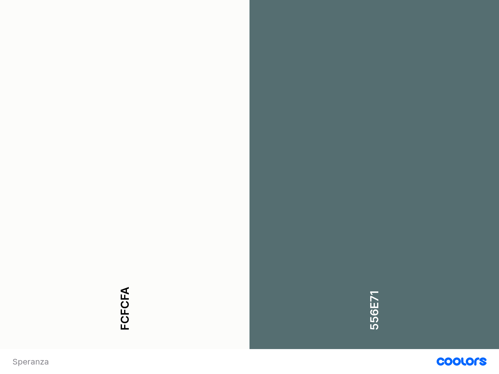

# ** SPERANZA**

---

## **Project Goal** 

***Speranza***, the italian word for ***Hope***.

The main goal of this project is to give a pinch of hope to cancer patients and their friends and relatives by introducing them to the latest advancements within the *immunotherapy* world, contributing to an easier access to clinical trials information available worldwide.

On top of this, provide the any user to share their stories about any given clinical trial.

***"Hope is the life we live, the attitude we carry, the gift we give others. Hope is the energy, the courage and the strength to keep believing in the goodness of life, God and the people around us."***

***Froyle Davies***

---

## **Table of contents**

1. [UX](#ux)

    1.1 [User Goals and Stories](#user-goals-and-stories)

    1.2 [User Requirements and Expectations](#user-requirements-and-expectations)
    
    1.3 [Company Goals](#company-goals)
    
    1.4 [Design Choices](#design-choices)

2. [Wireframes](#wireframes)
3. [Features](#features)
 
    3.1 [Existing Features](#existing-features)
 
    3.2 [Future Features](#future-features)

4. [Languages, Libraries, Frameworks and Tools](#languages-libraries-frameworks-and-tools)
 
    4.1 [Languages](#languages)
 
    4.2 [Libraries](#libraries)
 
    4.3 [Frameworks](#frameworks)
 
    4.4 [Tools](#tools)

5. [Testing and Debugging](#testing-and-debugging)
 
    5.1 [Test 1](#)
 
    5.2 [Test 2](#)
 
    5.3 [Test 3](#)

    5.4 [Test 4](#)
 
    5.5 [Test 5](#)
 
6. [Deployment](#deployment)

7. [Credits and Acknowledgments](#credits-and-acknowledgments)
 
    7.1 [Credits](#credits)
 
    7.2 [Acknowledgments](#acknowledgments)

---

## **UX**

---
[[Back to top]](#table-of-contents)

### **User Goals and Stories**
#### **Goals**
As a user I aim for:
* A simple and intuitive website.
* Easy navigation across pages.
* Visually attractive and accurate information.
* Appealing call-to-actions.

#### **Stories**
As a user, I want to:
* Get a brief introduction about what is immunotherapy.
* Access the most recent clinical trials available regarding immunotherapy.
* Shortlist the most interesting clinical trials into my dashboard.
* Share my opinion and see other users comments concerning a specific clinical trial.
* Access additional info about a certain clinical trial such as: 'recruitment status', 'study phase', 'gender' requirements, amongst others.

[[Back to top]](#table-of-contents)

### **User Requirements and Expectations**
#### **Requirements**
* Easy navigation.
* Reliable information.
* Good responsiveness across multiple devices and browsers.
* Immediate feedback on data inputs and/or submissions.
* Call-to-actions functioning properly.

#### **Expectations**
* Updated and clear information about the clinical trials.
* Links must be working properly to reach the target with any setbacks.
* External links must open in a new tab.
* Easy interaction with other users.
* Proper feedback handling an error.

[[Back to top]](#table-of-contents)

### **Company Goals**

* Provide healthcare patients, their family and firends, with the necessary information about clinical trials working with immunotherapy.

* Give doctors an easy way to look for potential clinical trials to recommend their patients.

* Advocate online for the immunotherapy approach as the future of medicine.

* Provide a safe space for users to share their stories and experiences in regard to a specific clinical trial.

[[Back to top]](#table-of-contents)

### **Design Choices**
#### Fonts

#### Icons
Throughout out the website, I will be using icons provided by [FontAwesome](https://fontawesome.com/ "FontAwesome").

The icons used are self-explanatory and aid the navigation of the user, bringing an intuitive imagery to the website.

#### Colors

#### Structure

The structure of this website will be quite simple as the main focus is on the data handling. Therefore, the website will consist of mainly 3 pages, the Landing Page, the Clinical Trials and the User's Dashboard page.

##### Navigation bar and Footer
Throuhgout the entire website, the user will constantly have access to the Navigation bar, displaying according to the need the necessary sections. 

Concerning the footer, it will display some contact information and any other less relevant content.

##### Landing Page
The Landing page will showcase the immunotherapy as the future of medecine with a brief introduction. Also, an inspirational sentence will give the user the proper perception of the webpage intent.

Below, the user will be able to see the most recent clinical trials, but without accessing all the details. If the user wants to see more details, they will have to properly register in order to acess the entire set of clinical trials and the corresponding details.

Also, on top of the landing page, considering the recurrent users, two call-to-action buttons will be displayed to improve the navigation.

##### User's authentication
The user's authentication method used on this website is based on the corresponding lesson of the [Code Institute](https://codeinstitute.net/ "Code Institue") Full Stack Software Development Course.

##### Clinical Trials
After a user is registered and logged in, it will have full access to the entire set of clinical trials, powered by a search feature in order to easily find the most suitable clinical trial for its needs.

All the clinical trials will be displayed as cards that will include an icon to shortlist the clinical trial or a trash bin icon if the user wants to remove it from through this page and not through its own dashboard.

##### User's Dashboard
The user's dashboard will only display the shorlisted clinical trials, including as well the search feature in case it is needed.

##### Comments Sections
The comments section will only be displayd when the user is logged in, and will be available through a modal where all the comments for any given clinical trial will be displayed, sorted by date (newest first).

[[Back to top]](#table-of-contents)

---

## **Wireframes**

[Small devices](wireframes/small-devices.png)

[Medium Devices](wireframes/medium-devices.png)

[Large devices](wireframes/large-devices.png)

---

## **Features**

[[Back to top]](#table-of-contents)

### **Existing Features**

#### ***Feature 1***

#### ***Feature 2***

#### ***Feature 3***

#### ***Feature 4***

#### ***Feature 5***

[[Back to top]](#table-of-contents)

### **Future Features**
* 

[[Back to top]](#table-of-contents)

---

## **Languages, Libraries, Frameworks and Tools**

[[Back to top]](#table-of-contents)

### **Languages**
* 

[[Back to top]](#table-of-contents)

### **Libraries**
* 

[[Back to top]](#table-of-contents)

### **Frameworks**
* 

[[Back to top]](#table-of-contents)

### **Tools**
* 

[[Back to top]](#table-of-contents)

---

## **Testing and Debugging**

[[Back to top]](#table-of-contents)

### **Test 1**

#### **User Stories and Requirements** ####

##### **UX** #####

##### **Execution** #####

##### **Testing** #####

##### **Test result** #####

##### **Conclusion** #####

### **Test 2**

#### **User Stories and Requirements** ####

##### **UX** #####

##### **Execution** #####

##### **Testing** #####

##### **Test result** #####

##### **Conclusion** #####

### **Test 3**

#### **User Stories and Requirements** ####

##### **UX** #####

##### **Execution** #####

##### **Testing** #####

##### **Test result** #####

##### **Conclusion** #####

### **Test 4**

#### **User Stories and Requirements** ####

##### **UX** #####

##### **Execution** #####

##### **Testing** #####

##### **Test result** #####

##### **Conclusion** #####

### **Test 5**

#### **User Stories and Requirements** ####

##### **UX** #####

##### **Execution** #####

##### **Testing** #####

##### **Test result** #####

##### **Conclusion** #####

[[Back to top]](#table-of-contents)

### **Debugging**
#### **Known Bugs and Corrections** ####

##### **Bug** #####

##### **(Potential) Corrections** #####

[[Back to top]](#table-of-contents)

---

## **Deployment**

[[Back to top]](#table-of-contents)

---

## **Credits and Acknowledgments**

[[Back to top]](#table-of-contents)

### **Credits**

#### **Media**

#### **Content**

[[Back to top]](#table-of-contents)

### **Acknowledgments**

[[Back to top]](#table-of-contents)